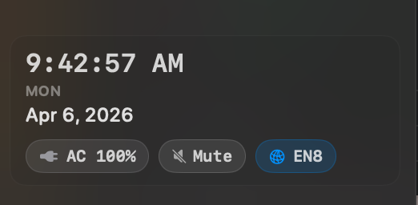
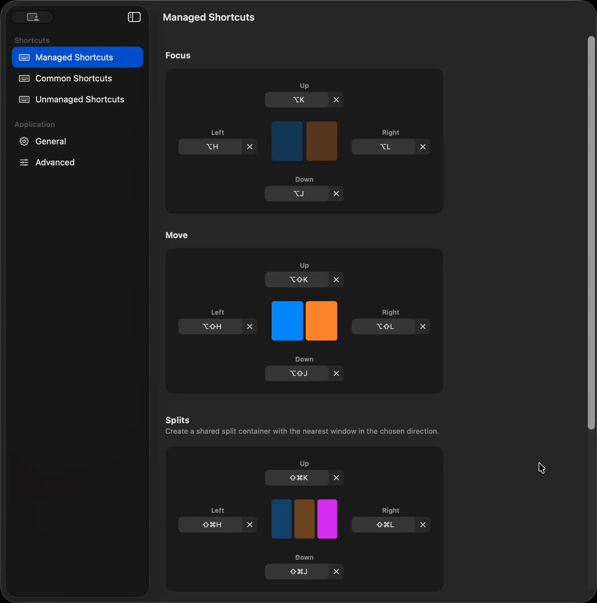
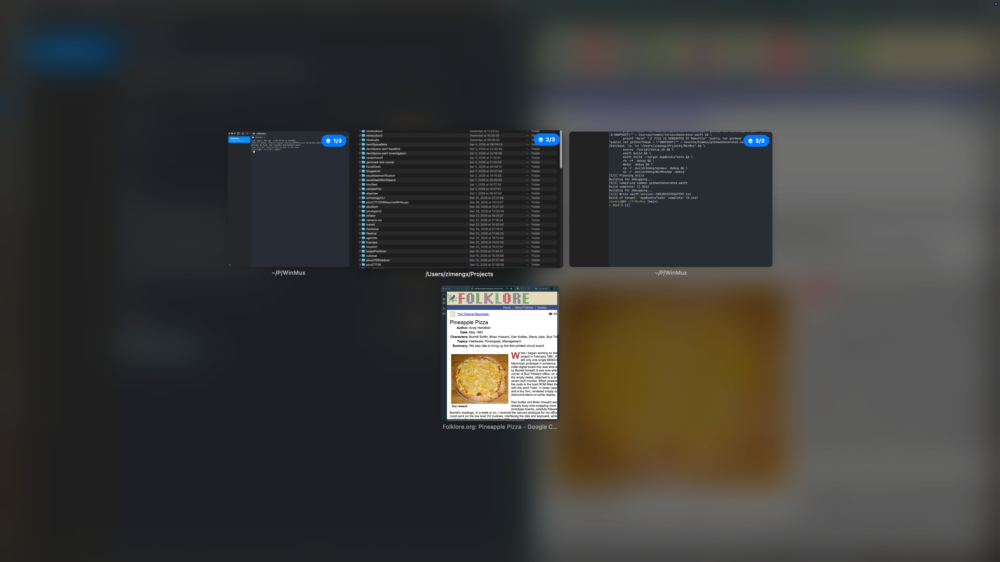

# WinMux *Beta*

WinMux is a intuitive, batteries-included WM for macOS built on Aerospace ([for now](#on-aerospace)). 


https://github.com/user-attachments/assets/69d8872a-d6f0-460e-95ad-d55013c3216e

An agent mode is in the works, read about it [here](https://blog.zimengxiong.com/#post/agents-will-need-a-good-window-manager) and see a [demo](https://cvx-me-api.alpacawebservices.com/api/storage/6dea289a-9559-49bd-87cf-42345f89c712
)—this is just for fun right now (dont expect anyone would use it), but still interesting to see.

## Managed (Tiling) Mode
<a href="intentzones.mp4">
  
</a>

WinMux has 6 intent (hover-hint) zones that make it easy to move windows without keyboard shortcuts:

1. Left/Right/Up/Down split
2. Form Tab Group (drag over top of a window)
3. Swap positions with window (drag over center)

## Unmanaged Mode (WIP)
<a href="cornersnapping.mp4">
  
</a>

In unmanaged mode, WinMux does not perform tiling. It still supports tab groups and the sidebar. In lieu of tiling, WinMux supports traditional corner snapping.

Unmanaged mode can be toggled from the menu bar or via settings.

## Highlights
### Tab Groups
<a href="tabgroups.mp4">
  
</a>

Tab groups allow you to have many windows occupy the same footprint, similar to Aerospace accordians or Yabai stacks. This is useful when you want to have multiple pieces of reference information next to an editor, multiple tabs in different browser profiles, or, when you simply want multiple fullscreen views without the additional friction and overhead of creating a new workspace.

Unlike accordians or stacks, WinMux tab groups behave more intuitively like you would expect tabs to in browsers, and don't need a keyboard shortcut to activate. You can drag tabs from tab groups into another window's [intent zone](#managed-tiling-mode), or in between workspaces. You can also rearrange tab order within a tab group, and navigate through them with relative and absolute keybindings. 

### Sidebar
<a href="sidebar.mp4">
  
</a>

The sidebar is a more interactively-performant and useful (though less customizable—WIP!) alternative to [Sketchybar](https://github.com/felixkratz/sketchybar) and Aerospace's built in menu bar dropdown for most everyday tasks. It provides better visibility into spaces and spatial awareness on the desktop.

You can drag windows in and out of the sidebar from and to the current workspace. You can rearrange windows across all spaces using the sidebar, including tab groups.



The sidebar can be configured (as shown) to display the current date, time, battery, sound, and network interface (things that I used to have in sketchybar).

### Settings


You do not need to open up a config file to change shortcuts for basic actions. More advanced actions still require editing of the config file (`~/.config/winmux/winmux.toml`). You can also edit, validate and reload the config file from within the settings!

### Misc
#### Exposé


WinMux comes with it's own mission-control-expose that shows you all the windows and tab groups in the current workspace. Trigger it with `⌃+i`

#### Displays
Only one display is supported at this time (I only use one display, so I don't have much experience/time to put in to figure out how multi displays should work, feel free to contribute). additional displays will still work, but will not be managed.

#### Workspaces
You can NOT create workspaces that have no windows in them. Workspaces with no windows are automatically destroyed.

#### App Launching
WinMux supports single-modifer keybindings (e.g. triggering an action on press of `⌘`)

I highly recommend that you configure the apps you use every day to be launch with Left/Right Option+Command, or similar shortcuts. Here is some of the apps that I have keybinded:

```toml
[mode.main.binding-tap]
    left-alt = 'exec-and-forget /Applications/Google\ Chrome.app/Contents/MacOS/Google\ Chrome --profile-directory="Default"'
    right-cmd = 'exec-and-forget /Applications/Google\ Chrome.app/Contents/MacOS/Google\ Chrome --profile-directory="Profile 1"'

[mode.main.binding]
    # Disable the native "Hide App" shortcut.
    cmd-h = []

    cmd-d = 'exec-and-forget osascript ~/Documents/scripts/launchTerminalWindow.scpt'
    cmd-e = 'exec-and-forget osascript ~/Documents/scripts/launchFinderWindow.scpt'
```

```applescript
# ~/Documents/scripts/launchTerminalWindow.scpt
tell application "cmux"
    if it is running
        tell application "System Events" to tell process "cmux"
            click menu item "New Window" of menu "File" of menu bar 1
        end tell
    else
        activate
    end if
end tell

# ~/Documents/scripts/launchFinderWindow.scpt
tell application "Finder"
    if it is running
        tell application "System Events" to tell process "Finder"
            click menu item "New Finder Window" of menu "File" of menu bar 1
        end tell
    else
        activate
    end if
end tell

```

#### On Aerospace
Aerospace is not known exactly, to be performant under load. Since it is not a root level program like Yabai, and works with virtual workspaces, it bugs out often and is really slow to use *when* e.g. your memory is being filled up or your CPU is under load. Under normal circumstances it is not noticable, and should feel snappier than something like Yabai.

This is especially noticable on lower-end devices (such as my MBA M2 with 16GB RAM). Virtual worksapces are also a pain to deal with. The eventual goal is to rebase WinMux on top of Yabai (and lose some of the features, but that's ok), or at least make it support a yabai "backend" (though a lot of the things we do require modifying the WM itself).

## Installation
Download the latest binary from releases and launch.

As WinMux is not signed, you will need to bypass gatekeeper:

```bash
xattr -dr com.apple.quarantine /Applications/WinMux.app/
```

## Migrating
### From AeroSpace
If `~/.config/winmux/winmux.toml` already exists, WinMux uses it as-is. It is a standard Aerospace config.

If it does not exist and an AeroSpace config exists, WinMux imports that config into `~/.config/winmux/winmux.toml` and uses it.

If neither exists, WinMux creates a new WinMux config with the bundled defaults.

After importing an AeroSpace config, add the WinMux-specific features you want with a block like this:

```toml
window-tabs.enabled = true
window-tabs.height = 34

[workspace-sidebar]
    enabled = true
    collapsed-width = 44
    width = 240
    monitor = 'main'
    show-status-pills = true
    show-date = true
```
## Release Build
Release builds use XcodeGen/Xcode

Build, archive, zip, and publish a GitHub release:

```bash
make release VERSION=0.1.0
```

The release build uses automatic signing with your local Apple Development certificate and team configured in the Makefile.

To build the release artifact without publishing to GitHub:

```bash
make release VERSION=0.1.0 PUBLISH=0
```

You can report issues via `Menu Bar > Report an Issue on Github`. Please consider contributing!!

## Roadmap
- [x] Tab groups
- [x] Sidebar
- [x] Window Snapping
- [ ] Tab groups working in unmanaged mode
- [ ] Workspace renaming
- [ ] Sidebar customization/plugins system
- [ ] Support for Yabai
- [ ] Integrate trackpad swiping support (see some work I did on [JiTouch](https://github.com/ZimengXiong/Jitouch2))

## Credits
The app logo/icon is still Aerospace's and will proab stay that way for a while. Been focusing on getting everything working first.

- https://github.com/nikitabobko/AeroSpace
- https://github.com/rxhanson/rectangle
- https://github.com/asmvik/yabai
- https://github.com/felixkratz/sketchybar
